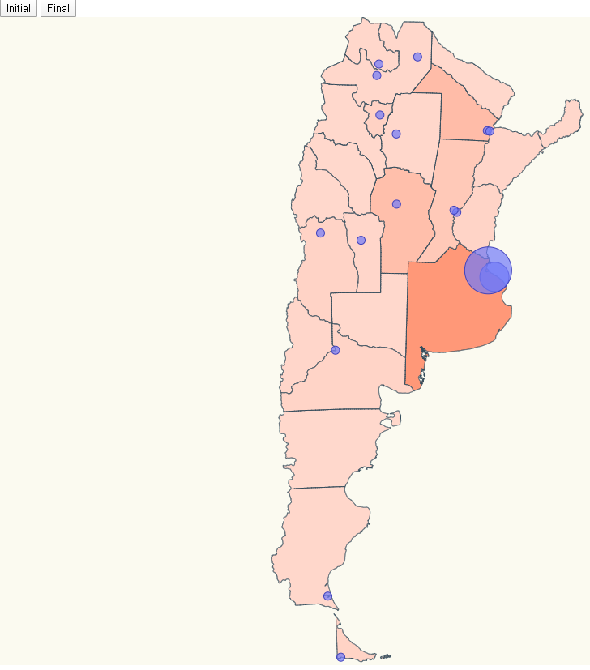

# COVID-19 in SPAIN (Module 9 Advance Exercise)

I focus on Spain affection by community displaying a map pinning affected locations and scaling that pin and map color according to the number of cases affected, something like:




# Steps

- I will take as starting example _02-pin-location-scale_ from https://github.com/dlouky/D3js_Ej1_Mandatory_Dlouky.git. Let's clone the project and execute _npm install_.

```bash
npm install
```

- Define the function to change map color acording to the cases per community.

_./src/index.ts_

```diff
// set the affected color scale
var color = d3
.scaleLinear<number, number>()
.domain([0, 9500])
.range([10, 90]);

 const assignCommunityBackgroundColor = (countryName: string, data: ResultEntry[]) => {
  const item = data.find(
    item => item.name === countryName
  );
  if (item) {
    console.log(item.value);
  }
  return item ? 100-color(item.value) : 100;
 };
 ```
 
 - Edit the svg map object.

_./src/index.ts_

```diff
svg
  .selectAll("path")
  .data(geojson["features"])
  .enter()
  .append("path")
  .attr("class", "country")
  // data loaded from json file
  .attr("d", geoPath as any)
+  .style("fill", function(d: any) {
+    console.log(d.properties.NAME_1)
+    let brigthness = assignCommunityBackgroundColor(d.properties.NAME_1, initial);
+    return `hsla(14, 100%, ${brigthness}%, 1)`;
  });
```

- Create a function to update the map colors.

_./src/index.ts_

```diff
const updateMaps = (data: ResultEntry[]) => {
  svg
  .selectAll("path")
  .data(geojson["features"])
  /*.merge(svg as any)*/
  .transition()
  .duration(500)
  // data loaded from json file
  .attr("d", geoPath as any)
  .style("fill", function(d: any) {
    console.log(d.properties.NAME_1)
    let brigthness = assignCommunityBackgroundColor(d.properties.NAME_1, data);
    return `hsla(14, 100%, ${brigthness}%, 1)`;
  });
};
```

- Alter the buttons behavior to include map update.

_./src/index.ts_

```diff
document
.getElementById("initial")
.addEventListener("click", function handleResultsInitial() {
  updateCircles(initial)
  updateMaps(initial);
});

document
.getElementById("final")
.addEventListener("click", function handleResultsFinal() {
  updateCircles(final)
+  updateMaps(final);
});
```

- If we run the project, voila ! we got the map just the way we want it.

```bash
npm start
```
