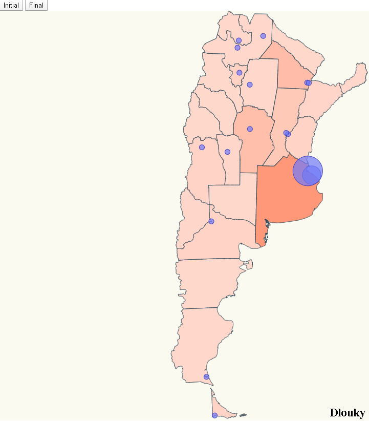

# COVID-19 in SPAIN (Module 9 Challenge Exercise)

I focus on Argentina affection by community displaying a map pinning affected locations and scaling that pin and map color according to the number of cases affected, something like:




# Steps

- I will take as starting example _D3js_Ej2_Advanced_Dlouky_ from https://github.com/dlouky/D3js_Ej2_Advanced_Dlouky.git. Let's clone the project and execute _npm install_.

```bash
npm install
```

- Replace the file spain.json with argentina.json. The content of argentina.json will be extracted from https://github.com/deldersveld/topojson/tree/master/countries/argentina

- Replace all the communinities.ts content by:

_./src/communinities.ts_

```diff
export const latLongCommunities = [
  {
    name: "Buenos Aires",
    lat: -34.9214516,
    long: -57.9545288
  },
  {
    name: "Catamarca",
    lat: -34.4586601,
    long: -58.9141998
  },
  {
    name: "Chaco",
    lat: -27.4605598,
    long: -58.9838905
  },
  {
    name: "Chubut",
    lat: -43.248951,
    long: -65.3050537
  },
  {
    name: "Ciudad de Buenos Aires",
    lat: -34.6131516,
    long: -58.3772316
  },
  {
    name: "Córdoba",
    lat: -31.4134998,
    long: -64.1810532
  },
  {
    name: "Corrientes",
    lat: -27.4806004,
    long: -58.8340988
  },
  {
    name: "Entre Ríos",
    lat: -31.7319698,
    long: -60.5237999
  },
  {
    name: "Formosa",
    lat: -26.1775303,
    long: -58.1781387
  },
  {
    name: "Jujuy",
    lat: -24.1945705,
    long: -65.2971191
  },
  {
    name: "La Pampa",
    lat: -36.6166687,
    long: -64.2833328
  },
  {
    name: "La Rioja",
    lat: -29.4110500,
    long: -66.8506700
  },
  {
    name: "Mendoza",
    lat: -32.8908386,
    long: -68.8271713
  },
  {
    name: "Misiones",
    lat: -23.8000000,
    long: -63.1166700
  },
  {
    name: "Neuquén",
    lat: -38.9516106,
    long: -68.0590973
  },
  {
    name: "Río-Negro",
    lat: -39.033329,
    long: -67.5833282
  },
  {
    name: "Salta",
    lat: -24.7859001,
    long: -65.4116592
  },
  {
    name: "San Juan",
    lat: -31.5375004,
    long: -68.5363922
  },
  {
    name: "San Luis",
    lat: -33.2950100,
    long: -66.3356300
  },
  {
    name: "Santa Cruz",
    lat: -51.6226082,
    long: -69.218132
  },
  {
    name: "Santa Fe",
    lat: -31.6333294,
    long: -60.7000008
  },
  {
    name: "Santiago del Estero",
    lat: -27.7951107,
    long: -64.2614899
  },
  {
    name: "Tierra del Fuego",
    lat: -54.7999992,
    long: -68.3000031
  },
  {
    name: "Tucumán",
    lat: -26.8241405,
    long: -65.2226028
  }
];
```

- Replace all the stats.ts content by:

_./src/stats.ts_

```diff
export interface ResultEntry {
  name: string;
  value: number;
}

export const final: ResultEntry[] = [
  {
    name: "Buenos Aires",
    value: 72
  },
  {
    name: "Catamarca",
    value: 0
  },
  {
    name: "Chaco",
    value: 31
  },
  {
    name: "Chubut",
    value: 0
  },
  {
    name: "Ciudad de Buenos Aires",
    value: 116
  },
  {
    name: "Córdoba",
    value: 28
  },
  {
    name: "Corrientes",
    value: 3
  },
  {
    name: "Entre Ríos",
    value: 4
  },
  {
    name: "Formosa",
    value: 0
  },
  {
    name: "Jujuy",
    value: 1
  },
  {
    name: "La Pampa",
    value: 0
  },
  {
    name: "La Rioja",
    value: 0
  },
  {
    name: "Mendoza",
    value: 5
  },
  {
    name: "Misiones",
    value: 1
  },
  {
    name: "Neuquén",
    value: 2
  },
  {
    name: "Río Negro",
    value: 4
  },
  {
    name: "Salta",
    value: 1
  },
  {
    name: "San Juan",
    value: 0
  },
  {
    name: "San Luis",
    value: 2
  },
  {
    name: "Santa Cruz",
    value: 1
  },
  {
    name: "Santa Fe",
    value: 17
  },
  {
    name: "Santiago del Estero",
    value: 1
  },
  {
    name: "Tierra del Fuego",
    value: 6
  },
  {
    name: "Tucumán",
    value: 7
  }
];

export const initial: ResultEntry[] = [
  {
    name: "Buenos Aires",
    value: 2
  },
  {
    name: "Catamarca",
    value: 0
  },
  {
    name: "Chaco",
    value: 1
  },
  {
    name: "Chubut",
    value: 0
  },
  {
    name: "Capital Federal",
    value: 2
  },
  {
    name: "Córdoba",
    value: 3
  },
  {
    name: "Corrientes",
    value: 0
  },
  {
    name: "Entre Ríos",
    value: 0
  },
  {
    name: "Formosa",
    value: 0
  },
  {
    name: "Jujuy",
    value: 0
  },
  {
    name: "La Pampa",
    value: 0
  },
  {
    name: "La Rioja",
    value: 0
  },
  {
    name: "Mendoza",
    value: 0
  },
  {
    name: "Misiones",
    value: 0
  },
  {
    name: "Neuquén",
    value: 0
  },
  {
    name: "Río Negro",
    value: 0
  },
  {
    name: "Salta",
    value: 0
  },
  {
    name: "San Juan",
    value: 0
  },
  {
    name: "San Luis",
    value: 0
  },
  {
    name: "Santa Cruz",
    value: 0
  },
  {
    name: "Santa Fe",
    value: 0
  },
  {
    name: "Santiago del Estero",
    value: 0
  },
  {
    name: "Tierra del Fuego",
    value: 0
  },
  {
    name: "Tucumán",
    value: 0
  }
];
```


- Change the imports from index.ts.

_./src/index.ts_

```diff
import * as d3 from "d3";
import * as topojson from "topojson-client";
+ const argentinajson = require("./argentina.json"); //https://github.com/deldersveld/topojson/tree/master/countries/argentina
const d3Composite = require("d3-composite-projections");
import { latLongCommunities } from "./communities";
import { initial, final, ResultEntry } from "./stats";
 ```
 
 - Edit the map projection.

_./src/index.ts_

```diff
const aProjection = d3.geoTransverseMercator()
.center([2.5, -38.5])
.rotate([66, 0])
.scale((800 * 56.5) / 33)
.translate([(1024 / 2), (800 / 2)]);

const geoPath = d3.geoPath().projection(aProjection);
const geojson = topojson.feature(argentinajson, argentinajson.objects.ARG_adm1);
```


- If we run the project, voila ! we got the map just the way we want it.

```bash
npm start
```
